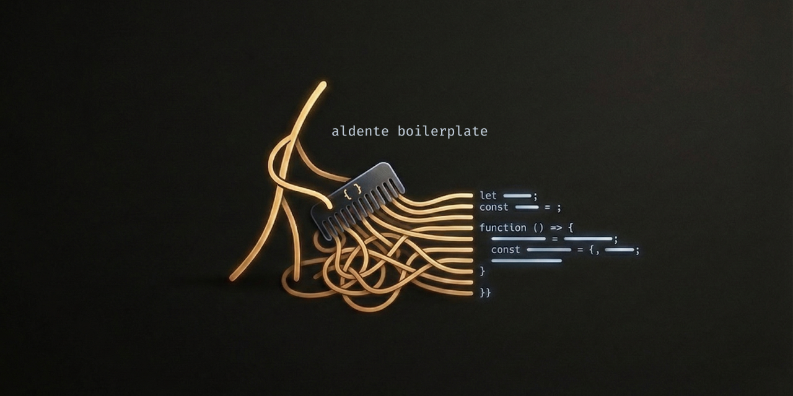

# SaaS Vibe-Coding Boilerplate

## What it is
A reusable prompt + docs kit for building SaaS products with vibe-coding tools like Lovable. Fill the docs, run the phases, and ship a clean, consistent app without rebuilding the fundamentals every time.

## Who it is for
Builders who want a structured, prompt-driven workflow that stays product-agnostic and tooling-flexible.

## What you get
- Structured `docs/` templates for product definition
- Phased prompts in `prompt/` for implementation
- A repeatable flow from idea to build
- Optional Phase 8 for CMS + Admin and Phase 11 for Launch + Audit

## Quick start
Start with `setup.md` for the full workflow and phase map.

## License
MIT. See `LICENSE`.
